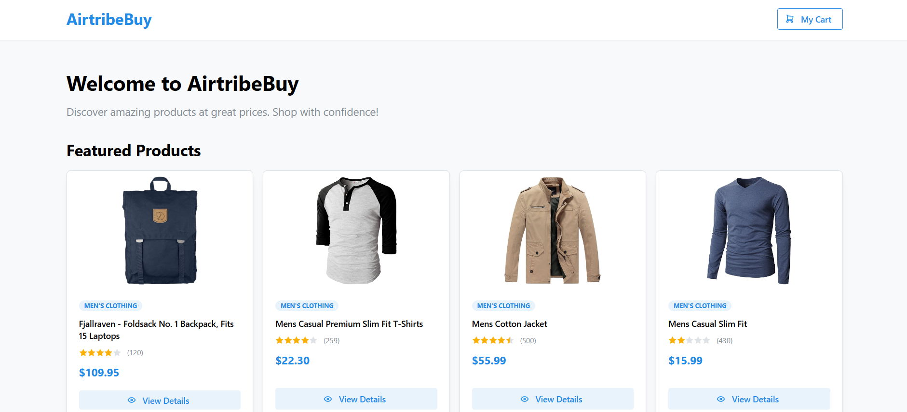
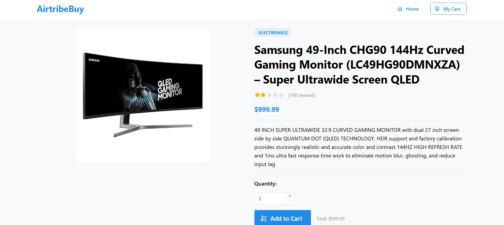
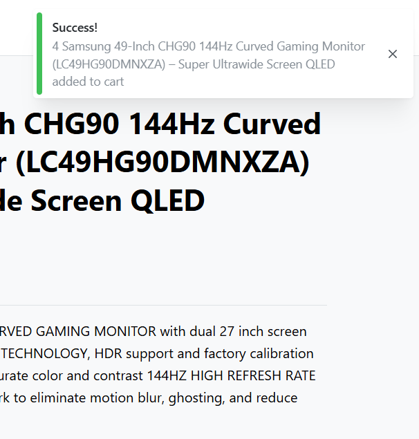
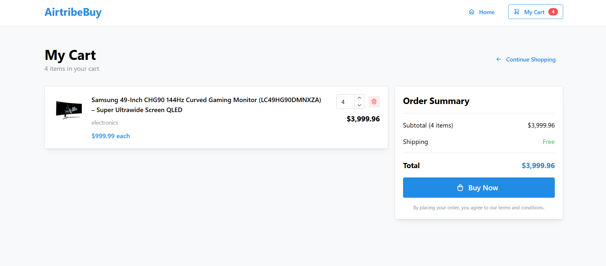

# 🛒 AirtribeBuy — React eCommerce Platform

A fully functional, responsive eCommerce platform built with **React 18**, **Vite**, **Redux Toolkit**, and **Mantine UI**, powered by the [FakeStore API](https://fakestoreapi.com).

---

## 📦 Features

✅ Product Listing  
✅ Product Details View  
✅ Add to Cart with Quantity  
✅ Cart Page with Update/Remove  
✅ Buy Now + Notification  
✅ Persistent Cart with LocalStorage  
✅ Responsive Design (Mobile/Desktop)  
✅ Loading States & Error Handling  

---

## ⚙️ Tech Stack

